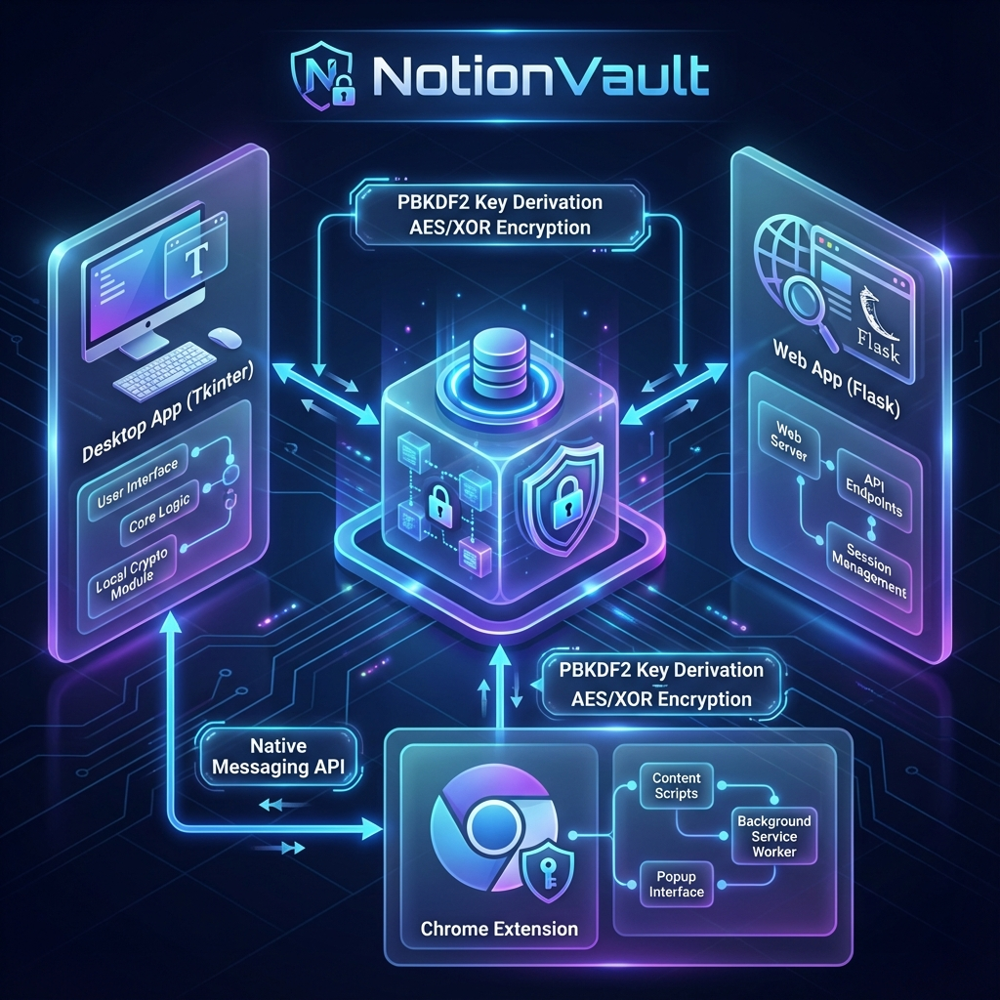

# 🔐 NotionVault - Advanced Password Manager

[](https://opensource.org/licenses/MIT)
[](https://www.python.org/)
[](https://flask.palletsprojects.com/)
[](https://developer.chrome.com/docs/extensions/mv3/intro/)

NotionVault is a secure, feature-rich password manager designed for simplicity, security, and versatility. It offers both a sleek desktop application and a modern web interface, ensuring your passwords are encrypted, organized, and accessible across devices.

---

## 📖 Project Documentation

We have comprehensive technical documentation available for developers and power users:

👉 **[View Technical Documentation & Architecture Reference](TECHNICAL_DOCUMENTATION.md)**

---

## 🌟 Key Features

### 🛡️ Military-Grade Security
- **PBKDF2 Key Derivation**: 200,000 iterations for bulletproof master password security.
- **Local-First Encryption**: Data is encrypted locally before being stored in the SQLite vault.
- **Zero-Knowledge Architecture**: Your master password never leaves your machine.

### 🍱 Multi-Client Ecosystem
- **Sleek Desktop App**: TTKBootstrap-themed GUI with advanced organizational tools.
- **Responsive Web Dashboard**: Manage your vault from any browser with a stunning Tailwind CSS interface.
- **Chrome Extension**: Intelligent auto-fill, credential fetching, and on-the-fly password generation.

### 📂 Organization & Productivity
- **Modular Blocks**: Store more than just passwords—Text notes, Tables, Headings, and Quotes.
- **Smart Folders**: Custom categorization with drag-and-drop reordering.
- **Instant Search**: Find any credential or note in milliseconds.

---

## 🏗️ High-Level Architecture



*Detailed component breakdown and data flow diagrams are available in the [Technical Documentation](TECHNICAL_DOCUMENTATION.md).*

---

## 🚀 Quick Start

### 1. Prerequisites
- Python 3.8 or higher
- `pip` package manager

### 2. Installation
```bash
git clone https://github.com/abm1119/password-manager-vault.git
cd password-manager-vault
pip install -r requirements.txt
```

### 3. Running the Apps
- **Desktop**: `python app.py`
- **Web App**: `python web_app.py`

### 4. Chrome Extension
1. Open Chrome and go to `chrome://extensions/`.
2. Enable "Developer mode".
3. Click "Load unpacked" and select the `PM_chrome_Extension` folder.

---

## 🤝 Contributing

We welcome contributions! Please see our [CONTRIBUTING.md](CONTRIBUTING.md) for guidelines on how to get involved.

## 📄 License

This project is licensed under the MIT License - see the [LICENSE](LICENSE) file for details.

---

**NotionVault** - Your secure digital vault for passwords and sensitive information. 🔒✨
