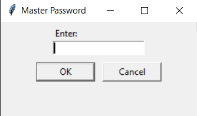
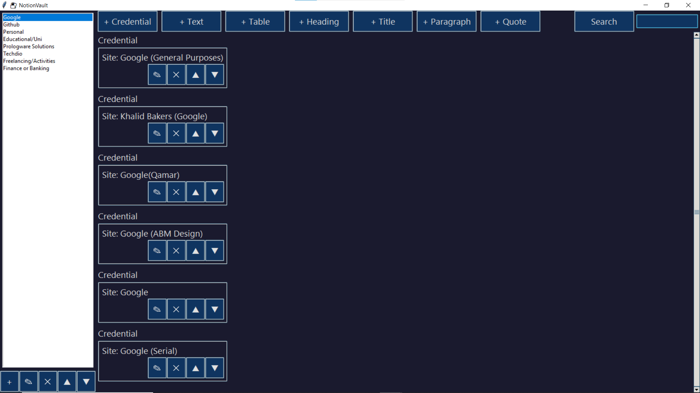
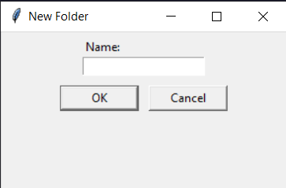
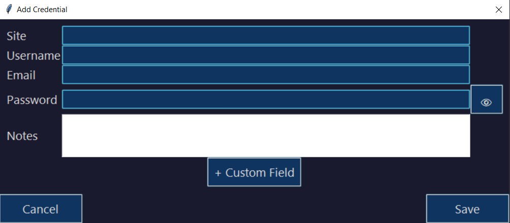

Password Manager Vault
Password Manager Vault is a Notion-style password management application created by Abdul Basit Memon. It allows users to securely store passwords, API keys, and other credentials offline, with support for folder organization, custom fields, and an interactive, customizable interface.

🌟 Features
🔒 Securely store passwords, API keys, and other sensitive credentials

📁 Organize credentials using folders with support for categories

➕ Add custom fields to credentials as needed

✍️ Create and style text, headings, paragraphs, quotes, and tables

🔎 Powerful search function for quick access

📤 Export credentials to Excel (XLSX) or JSON format

🎨 Apply interactive templates to enhance the UI experience

🖥️ Screenshots

⚙️ System Requirements
Python 3.12 or later

tkinter (built-in GUI library)

sqlite3 (built-in database)

openpyxl (Excel export)

json (built-in)

📦 Installation
Clone the repository

bash
Copy
Edit
git clone https://github.com/abm1119/password-manager-vault.git
cd password-manager-vault
Install required dependencies

bash
Copy
Edit
pip install -r requirements.txt
Run the application

bash
Copy
Edit
python app.py
📁 Application Structure
app.py – Main Tkinter GUI and logic

db_handler.py – SQLite database operations

styles.py – Theme and UI customization

screenshots/ – Screenshots for README and documentation

🗃️ Database Schema
users – Stores usernames and hashed passwords

passwords – Stores site, username, and encrypted password

Uses PBKDF2 for password hashing

🔐 Security
Passwords encrypted using PBKDF2

Input validation to prevent SQL injection

Local-only storage for full offline access and privacy

🚀 Future Development
🧑‍🤝‍🧑 Multi-user account support

📤 Secure password sharing and collaboration

🔐 Two-factor authentication

📄 Richer template and UI customization features

📁 Bulk import/export with encryption

📄 License
This project is licensed under the MIT License. See the LICENSE file for details.

🙏 Acknowledgments
Tkinter – for the GUI

sqlite3 – for local database

openpyxl – for Excel export

Python’s built-in json module – for JSON export