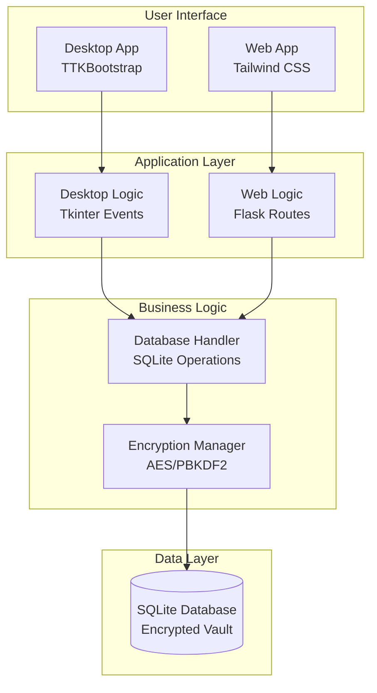
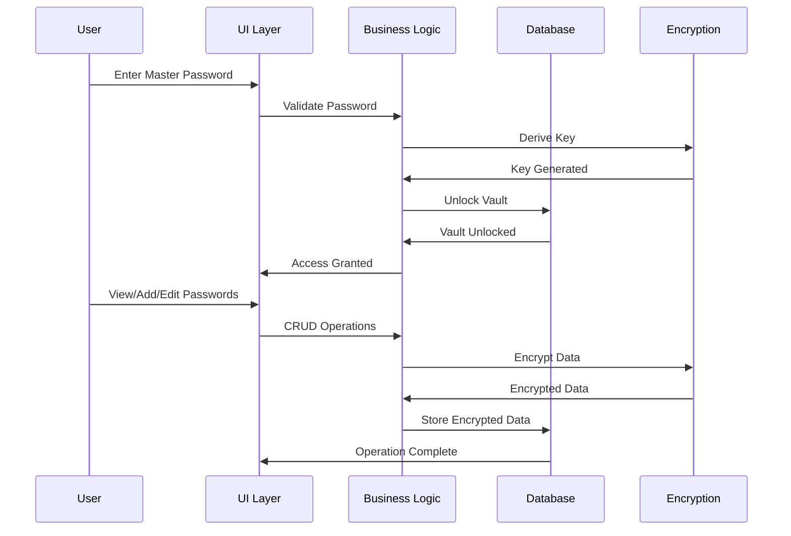

# 🔐 NotionVault - Advanced Password Manager

[](https://opensource.org/licenses/MIT)
[](https://www.python.org/)
[](https://flask.palletsprojects.com/)
[](https://docs.python.org/3/library/tkinter.html)

NotionVault is a secure, feature-rich password manager designed for simplicity, security, and versatility. It offers both a sleek desktop application and a modern web interface, ensuring your passwords are encrypted, organized, and accessible across devices.

## 🌟 Features

### Core Security
- **Military-Grade Encryption**: Uses AES encryption with PBKDF2 key derivation for unbreakable security.
- **Master Password Protection**: Single master password unlocks all stored credentials.
- **Secure Storage**: SQLite database with encrypted data at rest.

### User Interface
- **Desktop App**: Beautiful TTKBootstrap-themed GUI with modern dark mode.
- **Web App**: Responsive Tailwind CSS interface accessible via browser.
- **Intuitive Design**: Clean, minimalistic UI inspired by premium password managers.

### Organization
- **Folders**: Organize passwords into customizable folders.
- **Block Types**: Support for Credentials, Text notes, Tables, Headings, Titles, Paragraphs, and Quotes.
- **Search Functionality**: Quick search across all stored items.
- **Reordering**: Drag-and-drop style reordering of blocks and folders.

### Advanced Features
- **Cross-Platform**: Desktop app works on Windows, macOS, Linux; Web app runs in any browser.
- **Export/Import**: Future support for secure data export/import.
- **Session Management**: Secure web sessions with configurable timeouts.
- **Production Ready**: Web app uses Waitress WSGI server for high performance.

### Development Features
- **Modular Architecture**: Clean separation of concerns with reusable components.
- **Extensible**: Easy to add new block types, themes, or features.
- **Open Source**: Fully open-source under MIT license, community contributions welcome.

## 🏗️ Architecture

### High-Level Overview

```
┌─────────────────┐    ┌─────────────────┐    ┌─────────────────┐
│   Desktop App   │    │     Web App     │    │   Database      │
│   (Tkinter)     │    │    (Flask)      │    │   (SQLite)      │
└─────────────────┘    └─────────────────┘    └─────────────────┘
         │                       │                       │
         └───────────────────────┼───────────────────────┘
                                 │
                    ┌────────────────────┐
                    │  Encryption Layer  │
                    │    (AES + PBKDF2)  │
                    └────────────────────┘
```

### Component Diagram



### Data Flow



### Database Schema

```sql
-- Master password verification
CREATE TABLE meta (
    k TEXT PRIMARY KEY,
    v TEXT
);

-- Organizational folders
CREATE TABLE folders (
    id INTEGER PRIMARY KEY AUTOINCREMENT,
    name TEXT NOT NULL,
    sort INTEGER DEFAULT 0
);

-- Password/note blocks
CREATE TABLE blocks (
    id INTEGER PRIMARY KEY AUTOINCREMENT,
    folder_id INTEGER NOT NULL,
    type TEXT NOT NULL,
    content TEXT NOT NULL,
    sort INTEGER DEFAULT 0,
    FOREIGN KEY(folder_id) REFERENCES folders(id) ON DELETE CASCADE
);
```

## 🚀 Installation

### Prerequisites
- Python 3.8 or higher
- pip package manager

### Clone Repository
```bash
git clone https://github.com/yourusername/notionvault.git
cd notionvault
```

### Install Dependencies
```bash
pip install -r requirements.txt
```

### For Desktop App
The desktop app requires no additional setup beyond the Python dependencies.

### For Web App
The web app is ready to run with the installed dependencies.

## 📖 Usage

### Desktop Application
```bash
python app.py
```
- First run: Set up a master password and create your vault.
- Use the sidebar to manage folders.
- Add blocks using the toolbar buttons.
- Search and reorder items as needed.

### Web Application
```bash
# Development mode
set FLASK_ENV=development
python web_app.py

# Production mode
python web_app.py
```

Access the web app at the displayed URLs (typically http://127.0.0.1:5000).

### Environment Variables
- `SECRET_KEY`: Flask secret key (auto-generated if not set)
- `PORT`: Server port (default: 5000)
- `FLASK_ENV`: Set to 'development' for debug mode

## 🔧 API Documentation

### Web App Endpoints

#### Authentication
- `GET /` - Redirect to login or dashboard
- `GET/POST /login` - User authentication
- `GET/POST /setup` - Initial vault setup
- `GET /logout` - End user session

#### Dashboard
- `GET /dashboard` - Main application interface
- `POST /add_folder` - Create new folder
- `POST /rename_folder` - Rename existing folder
- `POST /delete_folder` - Remove folder

#### Block Management
- `GET /add_block/<btype>` - Add new block form
- `POST /add_block/<btype>` - Create new block
- `GET /edit_block/<bid>` - Edit block form
- `POST /edit_block/<bid>` - Update block
- `POST /delete_block/<bid>` - Delete block
- `GET /move_block/<bid>/<direction>` - Reorder blocks

## 🤝 Contributing

We welcome contributions! Please follow these steps:

1. Fork the repository
2. Create a feature branch: `git checkout -b feature-name`
3. Make your changes and add tests
4. Commit: `git commit -m 'Add feature'`
5. Push: `git push origin feature-name`
6. Submit a pull request

### Development Setup
```bash
# Install development dependencies
pip install -r requirements-dev.txt

# Run tests
python -m pytest

# Format code
black .
```

## 📄 License

This project is licensed under the MIT License - see the [LICENSE](LICENSE) file for details.

## 🙏 Credits

- **Encryption**: Based on Python's cryptography library
- **UI Frameworks**: Tailwind CSS, TTKBootstrap
- **Icons**: Emojis and custom icons
- **Inspiration**: Modern password managers like LastPass and Bitwarden

## 📞 Support

For questions, issues, or contributions:
- Open an issue on GitHub
- Email: your-email@example.com

---

**NotionVault** - Your secure digital vault for passwords and sensitive information. 🔒✨</content>
</xai:function_call">Successfully created file f:/Ideas/Password Manager App/README.md
